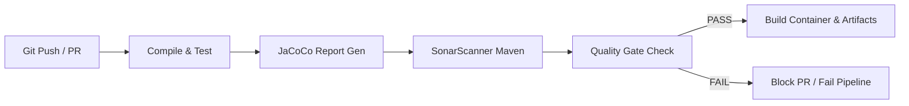

# SQ-01 Deliverable G — CI/CD SonarQube Integration Recommendations

## 1. Overview
This document details recommendations for integrating SonarQube quality checks and JaCoCo coverage analysis into the SPOREKART v3.0 CI/CD pipeline (`.github/workflows` or equivalent CI provider).

---

## 2. Recommended Pipeline Architecture

### 2.1 Pipeline Stages


---

## 3. GitHub Actions Workflow Integration Example

Create or update `.github/workflows/backend-sonar.yml`:

```yaml
name: Backend Quality & SonarQube Analysis

on:
  push:
    branches: [ main, release/*, sprint-* ]
  pull_request:
    types: [ opened, synchronize, reopened ]

jobs:
  sonar-analysis:
    name: Backend SonarQube Baseline & Quality Gate
    runs-on: ubuntu-latest

    steps:
      - name: Checkout Code
        uses: actions/checkout@v4
        with:
          fetch-depth: 0  # Shallow clones should be disabled for a better evaluation of analysis

      - name: Set up JDK 21
        uses: actions/setup-java@v4
        with:
          java-version: '21'
          distribution: 'temurin'
          cache: 'maven'

      - name: Run Maven Build, Tests & JaCoCo Coverage
        run: |
          cd backend
          mvn clean verify jacoco:report -Dmaven.test.failure.ignore=false

      - name: Run SonarQube Analysis
        env:
          GITHUB_TOKEN: ${{ secrets.GITHUB_TOKEN }}
          SONAR_TOKEN: ${{ secrets.SONAR_TOKEN }}
          SONAR_HOST_URL: ${{ secrets.SONAR_HOST_URL }}
        run: |
          cd backend
          mvn sonar:sonar \
            -Dsonar.projectKey=sporekart-backend \
            -Dsonar.projectName="Sporekart Backend" \
            -Dsonar.host.url=${SONAR_HOST_URL:-http://localhost:9000} \
            -Dsonar.token=${SONAR_TOKEN}

      - name: Quality Gate Status Check
        env:
          SONAR_TOKEN: ${{ secrets.SONAR_TOKEN }}
        run: |
          echo "Checking SonarQube Quality Gate result..."
          # Uses SonarQube quality gate CLI or REST API check
```

---

## 4. Key Recommendations & Best Practices

1. **Secret Management**:
   - Store `SONAR_TOKEN` and `SONAR_HOST_URL` as encrypted GitHub Actions / CI secrets.
   - Never commit raw Sonar tokens or database passwords to source control.

2. **Branch & PR Analysis**:
   - Configure SonarQube to analyze Pull Requests separately and decorate PRs with status checks.
   - Prevent merging PRs that fail the New Code Quality Gate (`0 Blocker/Critical Issues`, `>=90% Coverage`).

3. **Performance Optimization**:
   - Enable Maven dependency caching (`~/.m2/repository`).
   - Run tests and coverage in parallel threads (`mvn -T 1C verify`).

4. **Failure Behavior**:
   - In production-readiness mode (post SQ-09), failing the Quality Gate must fail the build job and block automated deployment.
