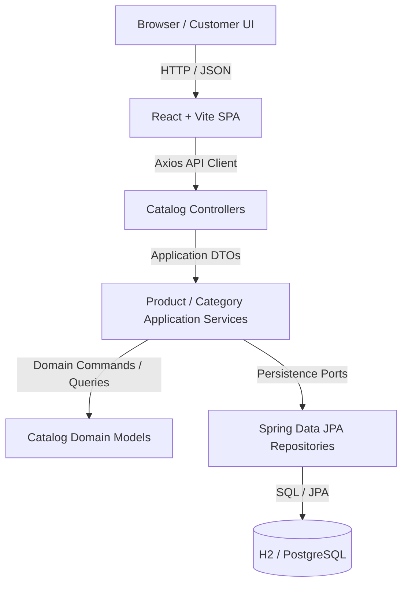

# SPOREKART v3.0 — CATALOG MODULE ARCHITECTURE

## 1. Executive Summary

The Catalog module forms the core domain of Sporekart v3.0, responsible for product discovery, category browsing, full-text search, filtering, sorting, pagination, and detailed product presentation. It is implemented as a clean, decoupled module within a Spring Boot 3.4 / Java 21 modular monolith backend and consumed by a Vite + React SPA frontend.

---

## 2. System Architecture

---

## 3. Module Boundaries & Responsibilities

### In-Scope (Catalog Domain Boundary):
- Product discovery & listing (`/products`)
- Search by product name and description
- Filtering by category, availability status, and min/max price bounds (`minPrice`, `maxPrice`)
- Whitelisted sorting (`createdAt`, `name`, `price`, `sku`, `status`)
- Server-side pagination (`page`, `size`, `totalElements`, `totalPages`)
- Category navigation & detail (`/categories`)
- Single Product Detail lookup by UUID or SKU (`/products/:productId`)
- Deterministic DEV/QAT data seeding (`CatalogDataSeeder`)

### Out-of-Scope (Owned by Future Modules):
- Cart & Checkout (Sprint 3)
- Customer Accounts & Auth (Sprint 4)
- Orders & Payments (Sprint 5)
- Shipping & Logistics (Sprint 6)
- Ratings & Reviews
- Admin Catalog Management

---

## 4. Layered Architecture Specifications

### 4.1 Frontend Layer (`frontend/src/features/catalog/`)
- **Pages**: `ProductListPage.tsx`, `ProductDetailPage.tsx`
- **Components**: `ProductGrid.tsx`, `ProductCard.tsx`, `CatalogFilterBar.tsx`, `PaginationControls.tsx`
- **Services**: `catalogApi.ts` (wraps Axios calls with `AbortSignal` support)
- **Hooks**: `useCatalog.ts` (TanStack Query hooks `useProducts`, `useProduct`, `useCategories`)
- **URL State**: Dual-way sync between URL query parameters (`search`, `categoryId`, `status`, `minPrice`, `maxPrice`, `sort`, `page`) and React state.

### 4.2 Backend Layer (`backend/src/main/java/com/sporekart/modules/catalog/`)
- **Controllers**: `CatalogProductController.java`, `CatalogCategoryController.java`
- **Application Services**: `ProductApplicationService.java`, `CategoryApplicationService.java`
- **Domain**: `Product.java`, `Category.java`, `ProductStatus.java`, `CategoryStatus.java`, `Money.java`
- **Infrastructure / Persistence**: `ProductEntity.java`, `CategoryEntity.java`, `SpringDataProductRepository.java`, `ProductRepositoryImpl.java`

---

## 5. Architectural Quality Attributes

1. **Zero JPA Entity Leakage**: Controllers strictly return `ApiResponse<PageResponse<ProductDto>>` or `ApiResponse<ProductDto>`. JPA Entities (`ProductEntity`, `CategoryEntity`) never escape the infrastructure package.
2. **N+1 Query Prevention**: Relational joins use `@EntityGraph` or custom projections.
3. **Database Portability**: Tested against H2 in-memory DB for DEV/QAT and compatible with PostgreSQL for production.
