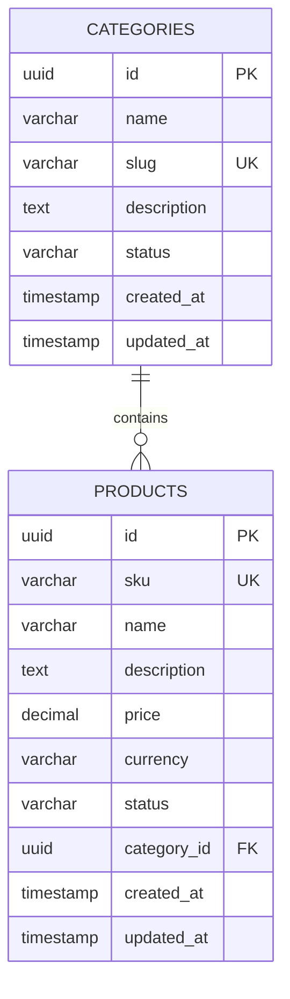

# SPOREKART v3.0 — CATALOG DATABASE MODEL & SCHEMA

## 1. ER Diagram

---

## 2. Table Specifications

### 2.1 Table: `categories`
| Column Name | Type | Constraints | Description |
|---|---|---|---|
| `id` | `UUID` | `PRIMARY KEY` | Unique identifier |
| `name` | `VARCHAR(255)` | `NOT NULL` | Human-readable category title |
| `slug` | `VARCHAR(255)` | `NOT NULL, UNIQUE` | URL-friendly slug |
| `description` | `TEXT` | `NULLABLE` | Category description |
| `status` | `VARCHAR(50)` | `NOT NULL` | `ACTIVE`, `INACTIVE` |
| `created_at` | `TIMESTAMP WITH TIME ZONE` | `NOT NULL` | Audit timestamp |
| `updated_at` | `TIMESTAMP WITH TIME ZONE` | `NOT NULL` | Audit timestamp |

### 2.2 Table: `products`
| Column Name | Type | Constraints | Description |
|---|---|---|---|
| `id` | `UUID` | `PRIMARY KEY` | Unique identifier |
| `sku` | `VARCHAR(100)` | `NOT NULL, UNIQUE` | Stock Keeping Unit |
| `name` | `VARCHAR(255)` | `NOT NULL` | Product name |
| `description` | `TEXT` | `NULLABLE` | Product description |
| `price` | `NUMERIC(12, 2)` | `NOT NULL` | Decimal monetary amount |
| `currency` | `VARCHAR(3)` | `NOT NULL` | ISO 4217 Currency code (e.g. `USD`) |
| `status` | `VARCHAR(50)` | `NOT NULL` | `ACTIVE`, `DRAFT`, `OUT_OF_STOCK`, `DISCONTINUED`, `ARCHIVED` |
| `category_id` | `UUID` | `FOREIGN KEY (categories.id)` | Category reference |
| `created_at` | `TIMESTAMP WITH TIME ZONE` | `NOT NULL` | Audit timestamp |
| `updated_at` | `TIMESTAMP WITH TIME ZONE` | `NOT NULL` | Audit timestamp |

---

## 3. Database Migrations (Flyway)

1. `V1__init_schema.sql`: Initial schema creation for `categories` and `products`.
2. `V2__catalog_seed_data.sql`: Seed data migration.
3. `V3__catalog_query_indexes.sql`:
   - `idx_products_price`: Index on `products(price)` for min/max price range query acceleration.
   - `idx_products_created_at`: Index on `products(created_at)` for sorting.
